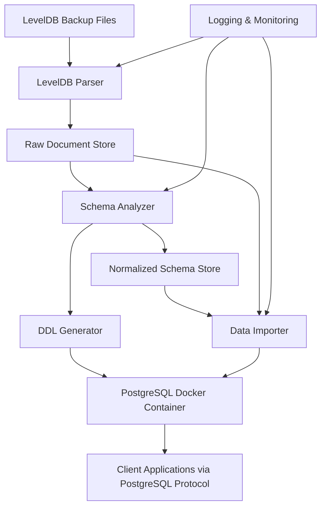

# Design Document

## Overview

Fireup is a migration system implemented in Rust that bridges Firestore and PostgreSQL by parsing LevelDB backup files, analyzing and normalizing schemas, and importing data directly into a PostgreSQL database. The system consists of three main components: LevelDB Parser, Schema Analyzer, and Data Importer. The system uses an official PostgreSQL Docker container as the backend storage engine, eliminating the need for a custom SQL Query Engine.

## Architecture



The architecture follows a pipeline approach where data flows from LevelDB parsing through schema analysis and normalization to direct import into the PostgreSQL Docker container. Clients can then connect directly to PostgreSQL using standard tools and protocols.

## Components and Interfaces

### 1. LevelDB Parser

**Purpose**: Parse Firestore backup files in LevelDB format according to Google's specification.

**Key Classes**:
- `LevelDBReader`: Handles low-level LevelDB file reading
- `FirestoreDocumentParser`: Converts LevelDB records to Firestore document structures
- `BackupValidator`: Validates backup file integrity

**Interfaces**:
```rust
pub trait LevelDBParser {
    async fn parse_backup(&self, file_path: &str) -> Result<ParseResult, ParseError>;
    async fn validate_backup(&self, file_path: &str) -> Result<ValidationResult, ValidationError>;
}

pub struct ParseResult {
    pub documents: Vec<FirestoreDocument>,
    pub collections: Vec<String>,
    pub metadata: BackupMetadata,
    pub errors: Vec<ParseError>,
}
```

**Implementation Details**:
- Uses streaming parsing for large backup files
- Implements CRC32 checksum validation per LevelDB specification
- Handles compressed and uncompressed log blocks
- Maintains document hierarchy and collection relationships

### 2. Schema Analyzer

**Purpose**: Analyze document structures, apply normalization rules, and generate optimized PostgreSQL schemas.

**Key Classes**:
- `DocumentStructureAnalyzer`: Analyzes field types and structures
- `NormalizationEngine`: Applies database normalization rules
- `TypeConflictResolver`: Handles data type inconsistencies
- `ConstraintAnalyzer`: Determines NOT NULL and other constraints

**Interfaces**:
```rust
pub trait SchemaAnalyzer {
    async fn analyze_documents(&self, documents: &[FirestoreDocument]) -> Result<SchemaAnalysis, AnalysisError>;
    fn generate_normalized_schema(&self, analysis: &SchemaAnalysis) -> NormalizedSchema;
    fn detect_type_conflicts(&self, analysis: &SchemaAnalysis) -> Vec<TypeConflict>;
}

pub struct NormalizedSchema {
    pub tables: Vec<TableDefinition>,
    pub relationships: Vec<Relationship>,
    pub constraints: Vec<Constraint>,
    pub warnings: Vec<SchemaWarning>,
}
```

**Normalization Rules**:
- 1NF: Eliminate repeating groups by creating separate tables for arrays
- 2NF: Remove partial dependencies by extracting composite key dependencies
- 3NF: Eliminate transitive dependencies through reference tables
- Denormalization for performance where appropriate (configurable)

### 3. DDL Generator

**Purpose**: Generate PostgreSQL DDL statements from normalized schema analysis.

**Key Classes**:
- `DDLGenerator`: Creates CREATE TABLE statements
- `ConstraintGenerator`: Generates constraint definitions
- `IndexGenerator`: Creates recommended indexes

**Output Format**:
```sql
-- Generated DDL for Firestore collection: users
CREATE TABLE users (
    id UUID PRIMARY KEY,
    email VARCHAR(255) NOT NULL UNIQUE,
    created_at TIMESTAMP NOT NULL,
    profile_id UUID REFERENCES user_profiles(id)
);

-- Normalized table for nested data
CREATE TABLE user_profiles (
    id UUID PRIMARY KEY,
    first_name VARCHAR(100) NOT NULL,
    last_name VARCHAR(100) NOT NULL,
    preferences JSONB
);
```

### 4. Data Transformer

**Purpose**: Transform parsed Firestore documents into normalized PostgreSQL table data for direct import.

**Key Classes**:
- `DocumentTransformer`: Converts documents to relational rows
- `DataTypeMapper`: Maps Firestore types to PostgreSQL types
- `RelationshipBuilder`: Establishes foreign key relationships
- `SQLGenerator`: Generates INSERT statements for PostgreSQL

**Type Mapping**:
- Firestore String → PostgreSQL VARCHAR/TEXT
- Firestore Number → PostgreSQL NUMERIC/INTEGER
- Firestore Boolean → PostgreSQL BOOLEAN
- Firestore Timestamp → PostgreSQL TIMESTAMP
- Firestore Reference → PostgreSQL UUID (foreign key)
- Firestore Array → Separate normalized table
- Firestore Map → JSONB or normalized tables

**Output Format**:
```sql
INSERT INTO users (id, email, created_at, profile_id) VALUES 
('550e8400-e29b-41d4-a716-446655440000', 'user@example.com', '2023-01-01 00:00:00', '550e8400-e29b-41d4-a716-446655440001');
```

### 5. Data Importer

**Purpose**: Import transformed data directly into the PostgreSQL Docker container.

**Key Classes**:
- `PostgreSQLImporter`: Manages database connections and bulk imports
- `BatchProcessor`: Handles large dataset imports in batches
- `TransactionManager`: Ensures data consistency during imports

**Import Features**:
- Bulk INSERT operations for performance
- Transaction-based imports with rollback capability
- Progress tracking and resumable imports
- Constraint validation during import
- Foreign key relationship establishment

## Data Models

### Core Data Structures

```rust
#[derive(Debug, Clone, Serialize, Deserialize)]
pub struct FirestoreDocument {
    pub id: String,
    pub collection: String,
    pub data: HashMap<String, serde_json::Value>,
    pub subcollections: Vec<FirestoreDocument>,
    pub metadata: DocumentMetadata,
}

#[derive(Debug, Clone)]
pub struct TableDefinition {
    pub name: String,
    pub columns: Vec<ColumnDefinition>,
    pub primary_key: Vec<String>,
    pub foreign_keys: Vec<ForeignKeyDefinition>,
    pub indexes: Vec<IndexDefinition>,
}

#[derive(Debug, Clone)]
pub struct ColumnDefinition {
    pub name: String,
    pub column_type: PostgreSQLType,
    pub nullable: bool,
    pub default_value: Option<serde_json::Value>,
    pub constraints: Vec<String>,
}
```

### Schema Analysis Results

```rust
#[derive(Debug, Clone)]
pub struct SchemaAnalysis {
    pub collections: Vec<CollectionAnalysis>,
    pub field_types: Vec<FieldTypeAnalysis>,
    pub relationships: Vec<DetectedRelationship>,
    pub normalization_opportunities: Vec<NormalizationOpportunity>,
}

#[derive(Debug, Clone)]
pub struct TypeConflict {
    pub field_path: String,
    pub conflicting_types: Vec<String>,
    pub occurrences: u32,
    pub suggested_resolution: String,
}
```

## Error Handling

### Error Categories

1. **Parse Errors**: LevelDB format violations, corrupted data
2. **Schema Errors**: Type conflicts, normalization issues
3. **Import Errors**: PostgreSQL constraint violations, connection issues
4. **System Errors**: I/O errors, memory issues, Docker container issues

### Error Response Strategy

- Detailed error messages with context and suggestions
- Graceful degradation for non-critical errors
- Transaction rollback for data consistency
- Comprehensive error logging for debugging

### Example Error Responses

```json
{
  "error": "TYPE_CONFLICT",
  "message": "Field 'age' has conflicting types: number (85%) and string (15%)",
  "suggestion": "Consider converting string values to numbers or using a union type",
  "affectedDocuments": 1247,
  "fieldPath": "users.age"
}
```

## Testing Strategy

### Unit Testing
- LevelDB parsing with various backup file formats
- Schema analysis with different document structures
- Data transformation and SQL generation
- PostgreSQL import operations

### Integration Testing
- End-to-end backup import workflows
- PostgreSQL client tool compatibility (psql, pgAdmin, etc.)
- Large dataset performance testing
- Schema normalization accuracy
- Docker container integration

### Performance Testing
- Large backup file parsing performance
- Query execution performance on normalized data
- Concurrent client connection handling
- Memory usage optimization

### Test Data Sets
- Sample Firestore backups with various schema patterns
- Edge cases: deeply nested documents, large arrays, type conflicts
- Performance datasets: millions of documents, complex relationships

## Security Considerations

### Authentication & Authorization
- PostgreSQL native authentication methods (handled by Docker container)
- Role-based access control for migrated data (PostgreSQL RBAC)
- Secure connection handling (SSL/TLS via PostgreSQL configuration)

### Data Protection
- Backup file validation to prevent malicious input
- SQL injection prevention in generated INSERT statements
- Audit logging for import operations and data modifications

### Network Security
- Docker network isolation for PostgreSQL container
- Secure connection strings and credential management
- Input validation and sanitization for all parsed data

## Development Environment

### PostgreSQL Docker Backend
For development and testing, the system uses a PostgreSQL Docker container as the backend storage engine:

```yaml
# docker-compose.yml
version: '3.8'
services:
  postgres:
    image: postgres:15
    environment:
      POSTGRES_DB: fireup_dev
      POSTGRES_USER: fireup
      POSTGRES_PASSWORD: fireup_dev_password
    ports:
      - "5432:5432"
    volumes:
      - postgres_data:/var/lib/postgresql/data
      - ./init.sql:/docker-entrypoint-initdb.d/init.sql

volumes:
  postgres_data:
```

### Rust Dependencies
Key Rust crates for implementation:
- `tokio-postgres`: Async PostgreSQL client
- `serde`: Serialization/deserialization
- `leveldb`: LevelDB file parsing
- `sqlparser`: SQL parsing and AST manipulation
- `tokio`: Async runtime
- `clap`: CLI argument parsing
- `tracing`: Structured logging
- `anyhow`: Error handling

## Performance Optimizations

### Parsing Optimizations
- Streaming LevelDB parsing for memory efficiency using Rust's async iterators
- Parallel document processing with `rayon` for CPU-bound tasks
- Incremental backup processing for large files with progress tracking

### Query Optimizations
- Automatic index creation based on query patterns
- Query plan caching and optimization using `dashmap` for concurrent access
- Connection pooling with `deadpool-postgres` for efficient resource management

### Storage Optimizations
- Efficient PostgreSQL data type selection based on Firestore field analysis
- Partitioning strategies for large collections using PostgreSQL native partitioning
- Compression for JSONB fields where appropriate with PostgreSQL TOAST